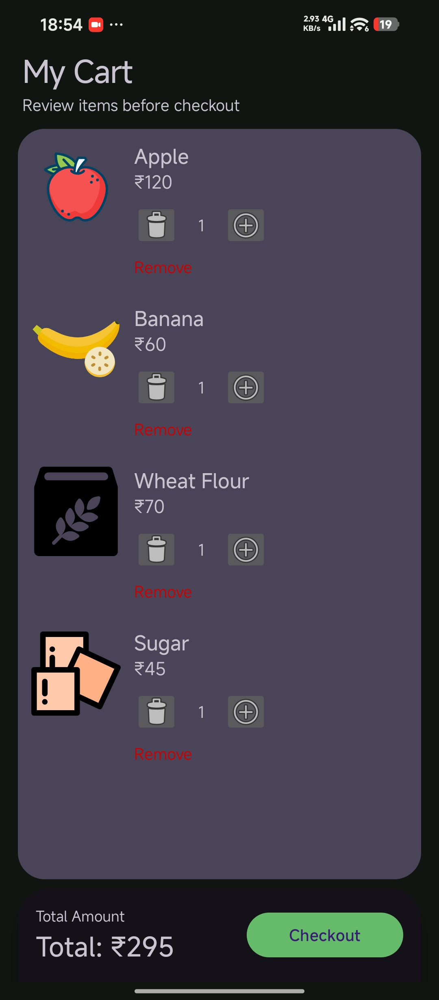
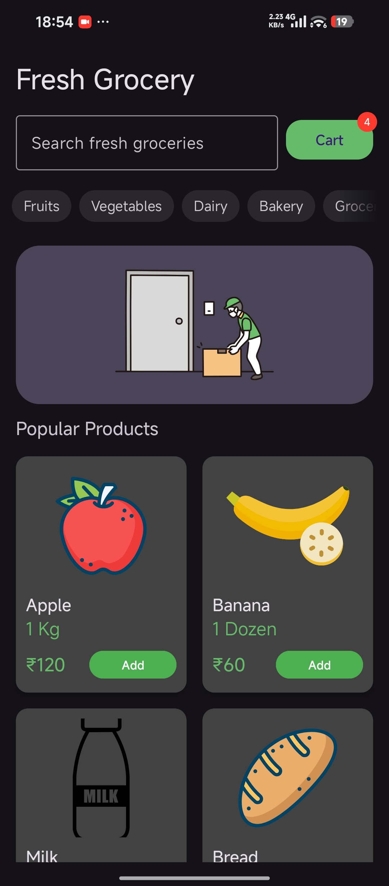
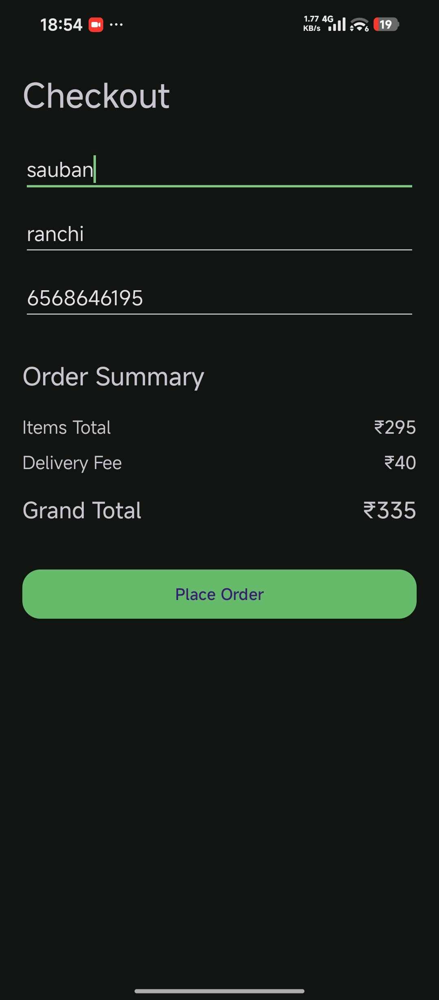
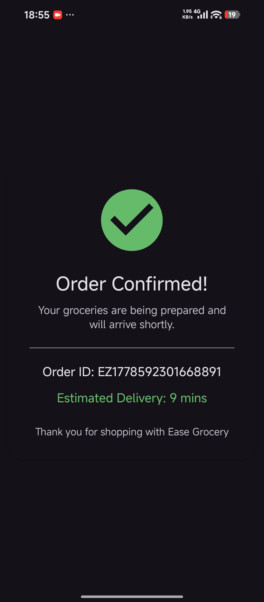
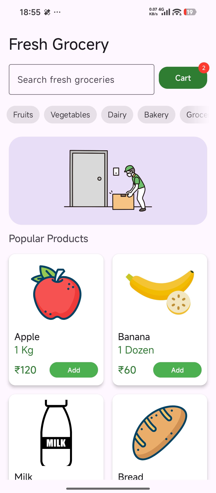
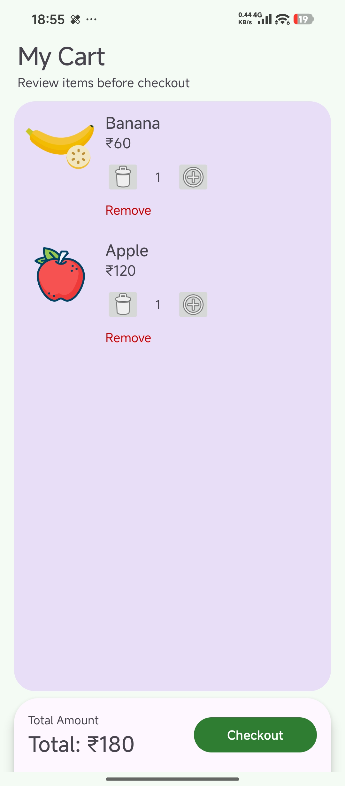
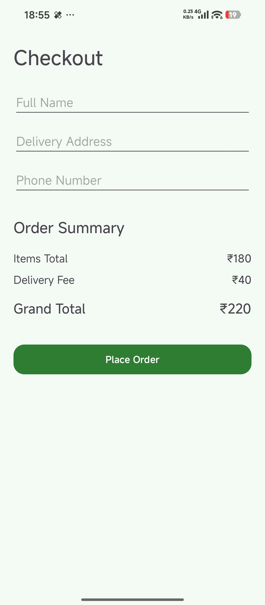
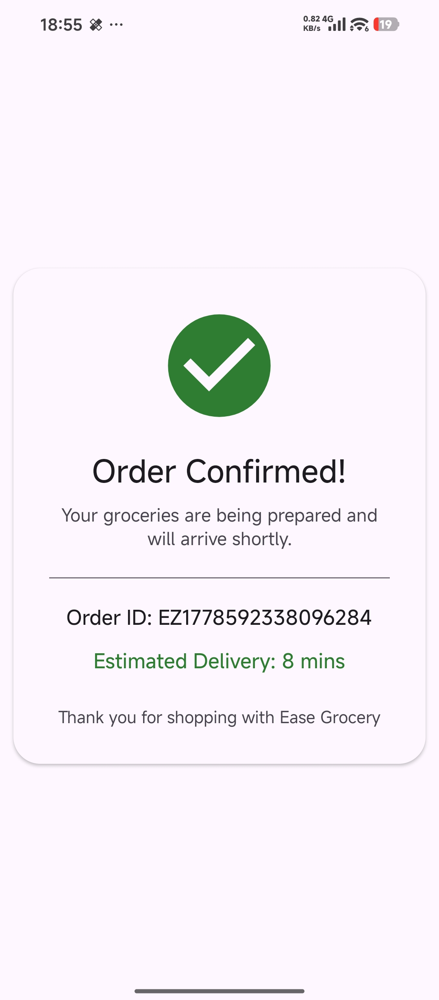

# EaseGrocery

EaseGrocery is a grocery shopping Android application developed using Kotlin and the MVVM architecture pattern. The application provides a clean and responsive shopping experience with cart management, checkout flow, and order success handling.

The project is built with XML layouts in Android Studio and follows modular and maintainable project structuring practices.

---
<!-- Row 1 -->
<p float="left">
  <a href="https://www.youtube.com/watch?v=VIDEO1">
    
  </a>
  <a href="https://www.youtube.com/watch?v=VIDEO2">
    
  </a>
  <a href="https://www.youtube.com/watch?v=VIDEO3">
    
  </a>
  <a href="https://www.youtube.com/watch?v=VIDEO4">
    
  </a>
</p>

<!-- Row 2 -->
<p float="left">
  <a href="https://www.youtube.com/watch?v=VIDEO5">
    
  </a>
  <a href="https://www.youtube.com/watch?v=VIDEO6">
    
  </a>
  <a href="https://www.youtube.com/watch?v=VIDEO7">
    
  </a>
  <a href="https://www.youtube.com/watch?v=VIDEO8">
    
  </a>
</p>

## Features

- User Login Authentication
- Browse Grocery Products
- Add Products to Cart
- Cart Quantity Management
- Checkout Flow
- Order Success Screen
- MVVM Architecture
- Shared Preferences Support
- RecyclerView Based Product Listing
- Clean XML User Interface
- Modular Code Structure

---

## Tech Stack

### Language
- Kotlin

### Architecture
- MVVM (Model - View - ViewModel)

### UI
- XML Layouts
- Material Components

### Local Storage
- SharedPreferences

### Android Components
- RecyclerView
- ViewModel
- LiveData
- Activities
- Adapters

---

## Project Structure

```bash
app/src/main/
├── AndroidManifest.xml
├── java/com/ease/grocery
│
├── data
│   ├── fake
│   ├── local
│   │   └── PrefManager.kt
│   ├── model
│   │   ├── CartItem.kt
│   │   └── Product.kt
│   └── repository
│       └── CartRepository.kt
│
├── di
│
├── navigation
│
├── ui
│   ├── adapters
│   │   ├── CartAdapter.kt
│   │   └── ProductAdapter.kt
│   │
│   ├── auth
│   │   ├── AuthViewModel.kt
│   │   └── Login.kt
│   │
│   ├── cart
│   │   ├── CartActivity.kt
│   │   └── CartViewModel.kt
│   │
│   ├── checkout
│   │   ├── CheckoutActivity.kt
│   │   └── CheckoutViewModel.kt
│   │
│   ├── home
│   │   ├── HomeActivity.kt
│   │   └── HomeViewModel.kt
│   │
│   └── success
│       ├── OrderSuccessActivity.kt
│       └── OrderSuccessViewModel.kt
│
├── MainActivity.kt
└── utils
```

---

## Resource Structure

```bash
res/
├── color
├── drawable
├── layout
├── mipmap
├── values
├── values-night
└── xml
```

### Layout Files

```bash
activity_cart.xml
activity_checkout.xml
activity_home.xml
activity_login.xml
activity_main.xml
activity_order_success.xml
cart_item.xml
product_item.xml
```

---

## MVVM Architecture Overview

### Model Layer
Handles application data and business logic.

- `Product.kt`
- `CartItem.kt`
- `CartRepository.kt`

### View Layer
Responsible for UI rendering using XML layouts and Activities.

- Activities
- RecyclerView Adapters
- XML Layout Files

### ViewModel Layer
Manages UI state and connects repository data to the UI.

- `HomeViewModel.kt`
- `CartViewModel.kt`
- `CheckoutViewModel.kt`
- `AuthViewModel.kt`
- `OrderSuccessViewModel.kt`

---

## Screens

### Authentication
- Login Screen

### Shopping
- Home Screen
- Product List
- Cart Screen
- Checkout Screen

### Order Flow
- Order Success Screen

---

## Drawables & Assets

The project includes custom grocery icons and UI assets such as:

- Fruits
- Vegetables
- Bread
- Milk
- Rice
- Sugar
- Salt
- Delivery Icons
- Success Icons
- Gradient Backgrounds

---

## Installation

### Clone Repository

```bash
git clone https://github.com/yourusername/EaseGrocery.git
```

### Open Project

1. Open Android Studio
2. Select "Open Existing Project"
3. Choose the EaseGrocery folder

### Build Project

```bash
Sync Project with Gradle Files
```

### Run Application

- Start an Emulator or connect an Android device
- Click Run in Android Studio

- Or you can use below link to download application directly on your android and run it.
  
  [Demo Release](https://github.com/Sauban-Git/EaseGrocery/releases/download/v0.1.0/EasyGrocery.apk)

---

## Future Improvements

- Firebase Authentication
- Online Payments
- Dark Mode
- Product Categories
- Search Functionality
- Wishlist
- Order History
- Offline Support
- Room Database Integration

---

## Learning Objectives

This project demonstrates:

- MVVM Architecture in Android
- RecyclerView Implementation
- ViewModel Usage
- XML Based UI Design
- Repository Pattern
- SharedPreferences Handling
- Clean Project Structuring

---

## License

This project is licensed under the MIT License.

---

## Author

Developed using Kotlin and Android Studio.
